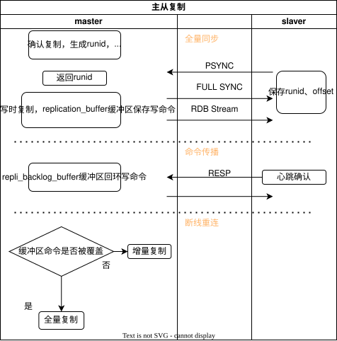

## 0. 安装

```bash
brew install redis
redis-server # 启动服务
redis-cli # 打开客户端
```

## 1. 基本语法与数据结构

生产环境优化问题

### 1.1 String

`symple dynamic string`简单动态字符串SDS，redis键都是字符串类型。

SDS（简单动态字符串）由 `len`、`free`、`buf` 三部分组成：

| 属性 | 作用 | 相对 C 字符串的优势 |
| --- | --- | --- |
| `len` | 记录字符串长度 | `strlen` 获取长度为 O(1) |
| `free` | 空间预分配 + 惰性释放 | 连续增长 N 次最多 N 次内存重分配；不立即释放多余空间；不会空间溢出（C 字符串会溢出） |
| `buf` | 字节数组存数据 | 二进制安全（C 字符串不能存二进制） |

`len`属性，`strlen`缩短获取长度的时间复杂度为O(1)。

`free`属性，空间预分配，`sdscat`连续增长N次字符串最多需要N次内存重分配；惰性空间释放策略，不会立刻释放不需要的内存空间而是用free预留。安全，不会空间溢出。C字符串会溢出。

`buf`属性字节数组，用来存储二进制安全的数据。C字符串不能存二进制。

### 1.2 List

常用于列表键、发布与订阅、慢查询、监视器等。
QuickList结构 = LinkedList + ZipList

- Redis 3.2 之前，小数据：ZipList，大数据：LinkedList
- Redis 3.2 之后，统一：QuickList，兼顾缓存和性能

### 1.3 字典

又称符号表、关联数组或映射，用于保存键值对的抽象数据结构。

哈希算法，根据键计算出哈希值和索引值，然后再根据索引值，将新键值对的哈希表节点放到哈希表数组指定索引上。

哈希冲突，当键生成的哈希值相等被分配到同一个索引上时，会发生`哈希冲突`。Redis使用`链地址法`解决键冲突，每个哈希表节点都有一个next指针，多个哈希表节点可以用next指针构成一个单向链表，这样可以解决键冲突问题。插入到链表表头，O(1)。

**rehash**，当哈希表保存的键值对逐渐增多或减少时，为了将哈希表的负载因子维持在合理范围，需要对哈希表进行扩展或收缩。

- 扩展：使用更大size的哈希表，将旧哈希表内容rehash到新哈希表，释放旧哈希表，将新哈希表索引改回旧索引，旧哈希表分配NULL。
- 自动扩展的条件：负载因子大于等于1；执行bgsave或bgrewriteaof且负载因子大于等于5。5是因为创建子进程时，操作系统的写时复制保证写命令，扩大负载因子为了尽可能避免哈希表的扩展操作从而减少不必要的内存写入。

渐进式rehash，旧哈希表的键值对rehash到新哈希表这个过程不是一次性、集中式的完成的，而是分多次、渐进式的完成的。rehashidx会记录已经完成rehash的索引（旧entry对值为NULL）。在这个过程中对字典进行的查询、删除、更新等都会在2个哈希表上进行，例如新增只会新增在新哈希表上，查找会先去旧哈希表查找找不到就去新哈希表找，保证旧哈希表不新增，只会随着rehash的操作最终变成空表。

### 1.4 跳跃表 skiplist

有序数据结构，它通过在每个节点中维护多个指向其他节点的指针，从而达到快速访问节点的目的。查找O(logn) 最坏 O(n)。

只有2个地方用到了跳表，有序集合键，集群。

根据分值进行的排序，二分查找。

结构：zskiplistNode跳跃表节点：层level、后退指针、分值、成员对象，zskiplist跳表保存节点的数量、头尾指针。

跳跃表节点：

- 层：level数组可以包含多个元素，指向其他节点；新建节点时，根据幂次定律（二八分布）随机生成1-32之间的值作为level数组的大小--高度。
- 前进指针：
- 后退指针：存上一个节点索引
- 分值score：double浮点型，排序依据，查找索引键
- 对象obj： SDS类型

API：

- 查找 ZSOCRE ZMEMBER
- 查询排名 zrank
- 插入 ZADD 
- 删除 ZREM 

### 1.5 整数

### 1.6 常见命令

|类型|常用命令|典型场景|
|---|---|---|
|**String**|`SET`, `GET`, `INCR`, `SETEX`|缓存、计数器、分布式锁|
|**Hash**|`HSET`, `HGET`, `HGETALL`|对象缓存（如用户信息）|
|**List**|`LPUSH`, `RPOP`, `LRANGE`|消息队列、最新列表|
|**Set**|`SADD`, `SISMEMBER`, `SINTER`|标签、共同好友|
|**ZSet**|`ZADD`, `ZRANGE`, `ZREVRANK`|排行榜、延时队列|

```bash
redis-cli -h 127.0.0.1 -p 6379 #指定主机和端口连接
ping # 测试连接 返回 PONG
echo "hello" # 输出字符串
select 0 # 切换到指定数据库 0-15
dbsize # 返回当前数据库的键数量
keys * # 查找所有符合模式的键，生产慎用 keys user:*
scan 0 match user:* count 10 # 增量迭代查找键，生产安全
exists key # 判断key是否存在
del key # 删除key
type key # 查看key数据类型
expire key 60 # 设置key过期时间 s 
ttl key # 查看 key 剩余过期时间 -1 不过期， -2不存在
persist key # 移除过期时间
```

> `scan 0 match user:* count 10`

1. scan 0 从游标0位置开始扫描。
2. match 是glob通配符风格而不是正则，* 匹配0个或任意多个字符，？匹配1个，[abc]匹配方括号内任意1个，\ 转义字符。规则发生在拿到数据之后。
3. count 10 表示大概遍历10个哈希槽位，可能这10个槽位有100个对象。注意和sql语法不同，不是对结果的计算而是对数据源的扫描范围。  

> **`keys` 不建议生产直接使用。**

1. 命令是全量扫描O(n)。redis单线程模式，会从头到尾遍历整个键空间字典，直接阻塞其他命令请求（读、写、心跳），瞬间触发大规模超时，可能直接导致雪崩。
2. 内存OOM，keys命令会把所有匹配的 key 一次性全部装载到内存，然后通过网络发送给客户端。如果匹配的 key 有100万个，redis先构建一个数组存放在输出缓冲区，这可能会瞬间占满内存导致服务器内存溢出OOM被系统kill，或者占满客户端连接的输出缓冲区，导致连接断开。
3. 无法中断与分页。一旦回车执行，就无法用 `ctrl + c` 或任何命令中断它（单线程被占满），而scan是渐进式迭代，每次只返回少量数据（游标机制），不用一次性承压。

如果需要高频查询 `user:*` 这种大键，不依赖scan或者keys，而是维护一个额外的set或者redis二级索引，例如 `SET user:index` 存所有的 `user_id`，或者直接用 `Sorted Set`，这样查询就是`O(1)`。完全规避扫描。

> [!TIP] String

```bash
set key value 
get key
mset k1 v1 k2 v2
mget k1 k2
setnx key value # 仅当键不存在时设置，分布式锁基础
setex key 60 value 
incr key # str( int(value) + 1 ) 如果转不了数字就会报错且不会修改
decr key # int(value) - 1 如果值不存在会视为 0，会先解析成64位有符号整数，常用语计数器、限流场景
incrby key 10 # value + 10
incrbyfloat
append key value # str(value) + str(value)
strlen key 
getrange key 0 3
setrange key 0 "X" # 覆盖指定偏移处的子串
```

> [!TIP] Hash

```bash
hset key field value # user:1 name alice
hget key field
hmset key f1 v1 f2 v2
hmget key f1 f2
hgetall key
hdel key f1
hlen key
hexists key f1
hkeys key
hvals key
hincrby key f1 1
```

> [!TIP] List

```bash
sadd key mumber
srem key menber
smembers key
sismembers key member
scard key # len(key)
sinter k1 k2 # member in k1 and member in k2
sunion k1 k2 # member in k1 + k2
sdiff k1 k2 # (members in k1) - (members in k2)
srandmember key count # random get count members
spop key # random remove member
```

Hash 只能单独对整个key设置ttl，先建立再expire。 `expire key timestamp`，不是field级别。

> [!TIP] Zset

```bash
zadd key score member # zadd z:1 100 kkk
zrem key member
zrange key 0 -1 # get members by increase
zrevrange key 0 -1 # get members by decrease
zrangebyscore key min max
zscore key member
zcard key # number of key
zcount key min max 
zincrby key increment member
zrank key member # 从0增序排名
zrevrank key member # 成员降序排名
zremrangebyrank key start stop # 按排名删除成员
```

- 双端：带有prev和next双向指针，O(1)复杂度获取前置or后置节点
- 无环：前置节点prev和表尾节点next都指向NULL
- 带表头指针和表尾指针：head，tail
- 带链表长度计数器：len属性，O(1)
- 多态：节点值可以保存不同类型的值

> [!TIP] 事务

```bash
multi # 开始事务
exec # 执行事务
discard # 取消事务
watch key # 监视键，

```

> [!TIP] 发布订阅

```bash
subscribe channel # 订阅频道
publish channe msg # 发布消息
psubscribe pattern # 按模式订阅
```

> [!TIP] 运维

```bash
save # rdb
bgsave # async save rdb
lastsave #上次成功保存的时间戳
config get maxmemory # 获取配置
config set maxmemory 1gb
flushdb # 清空当前数据库
flushall # 清空所有数据库
info # 获取服务器信息
```

> [!TIP] bgsave

会创建一个子进程来完成RDB快照的保存。为什么不用线程？

核心原因是操作系统的写时复制COW机制，当执行`bgsave`时，redis主进程会fork一个子进程，初始时共享同一块内存，只有当主进程修改数据时，操作系统才会复制被修改的内存页。

## 2. 核心原理

理解内存、持久化、过期机制，RDB/AOF，内存淘汰，过期删除，事务。

### 2.1 持久化机制-RDB

redis database,是redis的一种持久化方式，以二进制文件的形式保存到磁盘上dump.rdb 。

优点

- 文件紧凑，占用空间小
- 恢复速度快，是完整的快照，
- 性能影响小。

缺点

- 数据丢失风险，如果redis灾下一次快照之前发生宕机，最后一次快照的所有数据修改都会丢失。
- fork开销，会导致短暂服务阻塞。
- 频繁全量持久化，不适合过于频繁地执行。

### 2.2 持久化机制-AOF

通过记录服务器执行的所有写命令来保存数据状态，而不是像RDB那样保存某个时刻的快照。相当于一本命令日志，当redis需要恢复数据的时候，重新跑一遍AOF所有写命令，从而重建出当前的内存数据。命令写到磁盘文件用于重启恢复数据。“命令--磁盘”。

- 命令追加
- 文件写入与同步
- 文件重写

同步策略：always，everysec每秒同步一次--default，no由操作系统决定何时同步。

AOF重写：将多条写命令合并成一条最小集命令。手动执行`BGREWRITEAOF`，或配置触发，重写由子进程完成，同样利用写时复制，不阻塞主进程。

优点

- 数据更安全，最多丢失1s内的数据
- 支持故障恢复，redis-check-aof工具修复
- 格式可读

缺点

- 文件比RDB文件大
- 恢复速度慢
- 性能开销

RDB做数据备份，AOF保证数据不丢失。混合使用Redis 4.0+

### 2.3 过期与淘汰

#### 2.3.1 过期策略

惰性删除(get才判断是否过期)+定期删除（每隔200ms执行一次，随机抽取）

#### 2.3.2 内存淘汰策略

maxmemory，过期策略的兜底方案。allkeys-*, volatile-*.

> [!TIP] noeviction

默认策略，不淘汰，内存满时直接写入报错（适用数据绝对不能丢的场景）

> [!TIP] allkeys-lru

在所有key中，淘汰最近最少使用的key。24bits记录最后一次访问的时间戳。优先淘汰时间最早的。通用缓存场景首选，数据访问呈幂律分布，对数据的实效性要求高于绝对热度。

```python
# LRU 最近最少使用
class Node:
    __slot__ = 'prev', 'next', 'key', 'value', 'expire_at'
    def __init__(self, key=0, value=0, ttl=None):
        self.key = key
        self.value = value
        self.prev = None
        self.next = None
        self.expire_at = time.time() + ttl if ttl else None
    def is_expired(self):
        if self.expire_at is None:
            return False
        return time.time() >= self.expire_at

class TTLDoublyLinkedList:
    def __init__(self):
        self.head = Node()
        self.tail = Node()
        self.head.next = self.tail
        self.tail.prev = self.head
        self.size = 0
    def _remove_node(self, node):
        node.next.prev = node.prev
        node.prev.next = node.next
        node.prev = None
        node.next = None
        self.size -= 1

    def _add_to_head(self, node):
        node.prev = self.head
        node.next = self.head.next
        self.head.next.prev = node
        self.tail.next = node
        self.size += 1

    def _move_to_head(ealf, node):
        self._remove(node)
        self._add_to_head(node)
    def pop_tail(self):
        if self.size == 0:
            return None
        tail_node = self.tail.prev
        self._remove(tail_node)
        return tail_node
    def touch(self, node):
        """访问节点：先检查是否过期，过期则移除返回 False，否则移到头部"""
        if node.is_expired():
            self._remove(node)
            return False
        self._move_to_head(node)
        return True
    def insert(self, key, value, ttl):
        """插入新节点（插入前检查并移除所有过期节点）"""
        # 清理所有过期节点（也可以只清理尾部最旧的，但这里用全量清理保证准确）
        self.evict_expired()
        new_node = Node(key, value, ttl)
        self._add_to_head(new_node)
        return new_node
    def evict_expired(self):
        """从尾部向前检查（因为新数据在头部，旧数据在尾部，过期概率更高）"""
        current = self.tail.prev
        while current is not self.head:
            prev_node = current.prev
            if current.is_expired():
                self._remove(current)
            current = prev_node
    def __len__(self):
        return self.size

class TTL_LRU_Cache:
    def __init__(self, capacity, default_ttl=60):
        self.capacity = capacity
        self.default_ttl = default_ttl
        self.map = {}
        self.list = TTLDoublyLinkedList()
    def get(self, key):
        if key not in self.map:
            return -1
        node = self.map[key]
        if not self.list.touch(node):
            del self.map[key]
            return -1
        return node.value
    def put(self, key, value, ttl=None):
        if key in self.map:
            node = self.map[key]
            # 更新值，重新设置过期时间
            node.value = value
            node.expire_at = time.time() + (ttl if ttl is not None else self.default_ttl)
            self.list.touch(node)  # 移到头部
            return
        # 如果容量满了，先踢掉尾部节点（最久未使用，也可能过期）
        if len(self.map) >= self.capacity:
            tail_node = self.list.pop_tail()
            if tail_node:
                del self.map[tail_node.key]

        # 插入新节点
        new_node = self.list.insert(key, value, ttl or self.default_ttl)
        self.map[key] = new_node

```

> [!TIP] allkeys-lfu

在所有key中，淘汰访问频率最低的key。高16bits记录上次访问时间，低8bits记录访问频次。适合数据访问频率差异非常明显，且需要精确保留“长期热门”的数据，

> [!TIP] volatile-lru

在设置了过期时间的key中，淘汰最近最少使用的（部份key需要持久化），偶尔访问一次的数据会被保留。实现简单（双向链表），O(1)时间复杂度。

> [!TIP] volatile-lfu

在设置了过期时间的key中，淘汰频率最低的（精准淘汰低频过期数据）

> [!TIP] volatile-random

在设置了过期时间的key中，随机淘汰

> [!TIP] volatile-ttl

在设置了过期时间的key中，淘汰剩余ttl最短的（优先清理快过期的数据）

> [!TIP] 场景题

- 电商：allkeys-lfu，幂律分布
- 社交：allkeys-lru，时间轴
- 金融：volatiel-lru，淘汰人为设置过期时间的临时数据

### 2.4 事务

multi/exec

### 2.5 发布订阅

publish/subscribe

## 3. 常见业务问题

### 3.1 案例1：批量导出用户数据（快速找到一堆ID）

#### 方案一：Set二级索引 + 分批拉取

1. 场景：不需要按时间排序，只做导出（全量备份+迁移）(数据量：千万级别且字段复杂)
2. 思路：在写入user数据时，额外把id存到专用的set集合里。导出时，只扫描这个set。
3. 设计：用户详情：`SET user:{id} json_data`,索引集合：`SADD user:index {id}`。sscan获取到id后，用pipeline批量获取用户详情，性能高。支持过滤掉过期的数据。

#### 方案二：大Hash存所有用户（字段少，全量导出频繁）

1. 场景：用户数据字段比较固定，且经常需要一次性全量导出。(数据量：千万级别一次性)
2. 思路：不用 `user:{id}` 散列存储，直接用大hash存储所有字段，导出用HSCAN，一次网络请求搞定所有数据。
3. 设计：`HSET users:data {user_id} {json_data}`
4. 缺点：用户量极大（超过几百万），维护这个hash需要一定的内存开销，且无法单独为某个用户设计ttl。

#### 方案三：ZSET有序集合实现“分页导出”或“增量导出”

1. 场景：不仅要导出所有，还需要按注册时间分页导出，或导出前1000名。（后台管理）
2. 思路：用`ZSET`存储`userID`，`Score`存注册时间戳，导出用`ZRANGE`或`ZRANGEBYSCORE`，按偏移量和范围获取数据。
3. 设计：`ZADD user:by_time {timestamp} {user_id}`

总结：当场景既需要定期全量备份又需要支持条件查询导出时，用ZSET即可。但是当多条件时，Score只能存一个数值，多维度条件，推荐应用层过滤：用ZSET按时间范围捞取一批ID，再`Pipeline`去`GET user:{id}`获取详情，代码内存里判断其他条件，符合的放入导出列表，不符合的丢弃。

或者直接走备库/数仓：后台导出任务直接查mysql从库，异步导出。redis只负责存热数据（高频实时接口），当前在线用户状态和主键索引（时间排序）针对实时同步导出场景，复杂的sql交给数据库执行。

扩展：什么时候用ES，什么时候用redis，什么时候用mysql。ES和BM25和混合检索的分数融合。

### 3.2 案例2：大key的数据存储

> [!TIP]什么是大key
> 存储的体积大，内存占用多，元素多

|数据结构|判定标准（参考值）|
|--|--|
|String（字符串）|Value 值超过 10 KB。在一些高并发敏感场景下，阈值可能更低。|
|Hash / List / Set / ZSet（集合类型）|元素总数超过 5000 个，或虽然元素不多但成员本身的 Value 很大，导致总大小超过 10 MB|

> [!CAUTION] 大key的危害

- 阻塞服务与请求超时：操作大 Key（如读取、写入）本身耗时较长，会阻塞 Redis 主线程，导致其他所有命令排队等待，客户端请求超时
- 引发网络拥塞：一个 1MB 的大 Key，如果每秒被访问 1000 次，就会产生约 1GB 的网络流量，极易打满网卡带宽。
- 内存分布不均：在 Redis 集群中，大 Key 会导致数据倾斜，某个分片的内存和 CPU 使用率远高于其他分片，造成资源浪费和单点瓶颈。
- 主从同步与集群故障：错误删除：使用 DEL 命令删除大 Key 会长时间阻塞主线程，可能引发主从同步中断甚至主从切换。集群迁移失败：在对集群进行扩缩容或数据迁移时，过大的 Key 会导致迁移超时或失败。
- 增加持久化开销：大 Key 会使 RDB 快照和 AOF 重写过程变得更慢、更频繁，影响持久化效率。

> [!TIP]  如何发现大key

- redis-cli扫描
- 慢日志查询 showlog get 10
- rdb分析工具，redis-rdb-tools \ RDR

rdbtools根绝rdb文件可以生成csv文件

1. 查大key，`redis-cli --bigkeys`
2. 如果是大List/Zset，代码中分页查询（LRANGE加start/stop），禁止一次性读取。
3. 大String（JSON），拆解JSON，高频字段放redis，低频字段迁移到mysql或对象存储OSS桶，redis只存文件路径。拆分、迁移、压缩。
4. 不确定是否删除时，增加大的TTL过期时间，自动到期释放。
5. lazy free，不要直接使用del 删除大key，会导致长时间阻塞。在低峰期用脚本分批 UNLINK。

### 3.3 缓存相关

|问题|原因|解决方案|
|--|--|--|
|缓存穿透|查询不存在的数据，请求直接打到 DB|布隆过滤器、缓存空值|
|缓存击穿|热点 key 过期瞬间，大量请求涌入 DB|互斥锁、逻辑过期|
|缓存雪崩|大量 key 同时过期，DB 压力暴增|过期时间加随机值、多级缓存|

#### 3.3.1 缓存穿透

缓存没数据，直接查数据库，数据库也没有返回null，查一次缓存查一次db占用性能。在redis缓存里设置不存在的数据为null直接返回；布隆过滤器。

#### 3.3.2 缓存击穿

（突发性）热点key过期，互斥锁方案 set nx；逻辑过期方案：过期时间刷新访问就续期+后台线程更新检查逻辑过期时间。`freshtoken`

> [!TIP] 导入批量商品数据

- 过期时间设置随机值

#### 3.3.3 缓存雪崩

大量key在同一时刻失效，随机过期时间。

### 3.4 分布式锁

原始命令 set nx -- 加过期时间 -- 原子命令 -- 加唯一标识

set nx时，如果处理业务逻辑时网络抖动或中断，锁没有被释放，下次再次处理时发现有锁会一直被锁住无法修改，所以需要加过期时间finaly自动释放锁，注意加ttl时需要保持原子性--创建锁语句里加ttl；

当ttl短于业务代码执行时间时提前释放锁，被其他用户注册锁继续修改数据，其他线程处理中此时走到删除锁语句继续导致锁被提前释放，又可以被其他线程创建，引发数据重复或者不一致；并发安全问题。

因而需要加client `uuid`，创建自己的锁，此时校验+删除语句也可能被卡住导致ttl过期提前释放，因而需要使用lua脚本保证原子性。

ttl提前过期还需要锁续期，看门狗，开启后台异步线程，默认30s的锁会尝试10s（1/3）一次续期。续期执行lua脚本：检查key是否存在，检查key是否被当前线程持有，都符合才续期。`lock()\unlock()`.

1、加锁 2、锁续期 3、释放锁

> [!CAUTION]注意
> 创建带ttl的锁（原子性，创建锁和设置ttl用一行语句，如果分2步宕机了就永远在内存里），用trycatch包裹业务代码，finnaly要释放锁。

问题1:ttl时间少于业务语句执行时间，锁提前过期，不同的请求对同一个锁，导致其他线程一直在执行完成前删锁导致锁失效。
解决1:锁加uuid，用户创建自己用的锁，删除key时也要保证原子性，时间也要续期。
加上uuid之后删除也只能删除自己的锁，解锁时必须用lua脚本保证原子性，如果用if判断是否存在然后再去删除，中间卡住就有问题了，另一个客户端如果获得了锁就会被你误删，删锁之后其他客户端可以继续创建锁进行操作并认为自己持锁导致数据不一致，重复操作等。lua脚本可以保证校验+删除在单线程中一次性执行不会被中断。手动执行容易踩坑，java支持框redisson框架。

> [!TIP] redlock

redis奇数个实例，半数以上能加锁成功就成功。everysec 1s内，也会有并发安全问题，3个里面如果有一个redis实例在重启导致加锁失败，1个成功，客户端访问剩下的未加锁的实例会重复加锁成功导致重复修改。

> 示例：商品扣库存

保证库存扣减一致性

> 下单

1、提交订单幂等性，重复提交，还是并发场景，
2、订单未支付倒计时取消，踢进延迟队列死信队列处理，
3、后端取消进行时修改订单为已取消和前端提交时已支付冲突，

### 3.5 排行榜

### 3.6 消息队列

## 4. 高可用与集群

主从复制、哨兵、CLuster、性能调优

### 主从复制

一个主redis负责写入，从节点负责读数据，缓解主redis压力。
实现原理：

- 第一阶段

> 建立连接与全量同步
当从节点第一次连上主节点时，从节点发送PSYNC命令，RDB全量复制同步一次，主节点执行bgsave将快照发给从节点，在这个期间主节点产生的新的写命令会暂存到Replication Buffer内存缓冲区里，等快照发完了，再从复制积压缓冲区里把命令发给从节点保证数据不丢失。

- 第二阶段

> 命令传播
全量同步完成后，主从节点会建立长连接，主节点每收到一个写命令都会异步发送给从节点。心跳包确认存活（Ping/Ack）。
数据同步机制“命令-网络-从节点”，用于数据冗余和读写分离。RESP协议格式。主节点维护一个固定大小的环形缓冲区，保存最近的写命令。主从节点都记录复制偏移量 replication offset，记录已经同步的命令位置。

- 第三阶段

> 断线重连与增量同步
当节点首次连接时，或复制偏移量差距过大导致无法增量同步时，主节点生成RDB发送给从节点，全量复制。
在从节点加载完RDB后，通过复制积压缓冲区repli_backlog_buffer，主节点持续发送写命令给从节点。

2个缓冲区不同，数量不同，大小不同，生命周期不同，用途不同。

- replication_buffer：从节点有几个就有几个，全量复制时存写命令的，大小通过client-output-buffer-limit控制，超出时会断开导致重新全量复制。
- repl_backlog_buffer:主节点一个，通过repl-backlog-size控制大小，是给断线重连的从节点使用，默认1MB比较小，需要调大100MB，写满了就覆盖最早的数据。



### 哨兵

如何选举

### 故障转移

### 集群

哈希，环，槽位，路由，cluster限制，hash tag 

